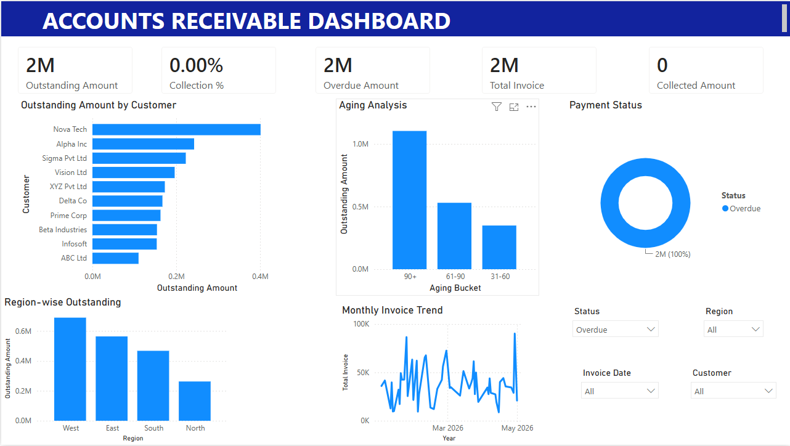

# 📊 Accounts Receivable Dashboard

An interactive **Accounts Receivable Dashboard** built using **Microsoft Excel** and **Power BI** to monitor invoice collections, outstanding balances, payment status, aging analysis, and customer-wise receivables.

This project demonstrates data cleaning, financial reporting, DAX calculations, and dashboard development using Power BI.

---

## 📌 Project Objective

The objective of this project is to help finance teams monitor customer payments, identify overdue invoices, track outstanding balances, and analyze collection performance through an interactive dashboard.

---

## 🛠️ Tools & Technologies

- Microsoft Excel
- Power BI Desktop
- Power Query
- DAX (Data Analysis Expressions)

---

## 📂 Dataset

The dataset contains invoice transaction details including:

- Invoice Number
- Customer Name
- Invoice Date
- Due Date
- Invoice Amount
- Paid Amount
- Outstanding Amount
- Payment Status
- Region
- Days Overdue
- Aging Bucket

---

## 📈 Dashboard KPIs

The dashboard provides the following key performance indicators:

- 💰 Total Invoice Amount
- 💵 Collected Amount
- 📄 Outstanding Amount
- 📊 Collection Percentage
- ⏰ Overdue Amount

---

## 📊 Dashboard Visualizations

### KPI Cards
Displays important business metrics at a glance.

### Outstanding Amount by Customer
Shows customers with the highest outstanding balances.

### Aging Analysis
Categorizes outstanding invoices into:

- 0–30 Days
- 31–60 Days
- 61–90 Days
- 90+ Days

### Payment Status
Displays Paid, Partial, and Overdue invoices.

### Region-wise Outstanding
Shows outstanding balances across different regions.

### Monthly Invoice Trend
Visualizes invoice amounts over time.

### Interactive Filters

- Region
- Customer
- Status
- Invoice Date

---

## ⚙️ DAX Measures

```DAX
Total Invoice =
SUM(Transactions[Amount])

Collected Amount =
SUM(Transactions[Paid Amount])

Outstanding Amount =
SUM(Transactions[Outstanding])

Collection % =
DIVIDE([Collected Amount],[Total Invoice],0)

Overdue Amount =
CALCULATE(
SUM(Transactions[Outstanding]),
Transactions[Status]="Overdue"
)

Total Customers =
DISTINCTCOUNT(Transactions[Customer])

Total Invoices =
COUNT(Transactions[Invoice No])
```

---

## 📷 Dashboard Preview



---

## 📁 Repository Structure

```
Accounts-Receivable-Dashboard
│
├── Accounts_Receivable_Data.xlsx
├── Accounts_Receivable_Dashboard.pbix
├── Dashboard_Screenshot.png
├── README.md
```

---

## 💡 Key Features

- Interactive KPI Cards
- Customer Outstanding Analysis
- Aging Bucket Analysis
- Region-wise Financial Reporting
- Payment Status Monitoring
- Monthly Invoice Trend
- Dynamic Filters
- Data Cleaning using Power Query
- DAX Measures
- Professional Dashboard Layout

---

## 🎯 Business Insights

- Identify customers with high outstanding balances.
- Monitor invoice collection performance.
- Analyze overdue payments using aging buckets.
- Track monthly invoice trends.
- Compare outstanding balances across regions.
- Improve collection efficiency using interactive filters.

---

## 🚀 Future Enhancements

- Customer Risk Score
- Collection Forecasting
- Automated Email Reminder Dashboard
- Finance KPI Scorecards
- Real-Time SQL Database Integration
- Power BI Service Publishing
- Mobile Dashboard Layout

---

## 👨‍💻 Author

**Bhavesh Patil**

B.Sc. Computer Science Graduate

Skills:
- Power BI
- Excel
- SQL
- Python
- Data Analysis
- Data Visualization

LinkedIn: https://www.linkedin.com/in/bhavesh-patil-825b55378

GitHub: https://github.com/bhaveshp5

---

⭐ If you found this project useful, consider giving it a star.
